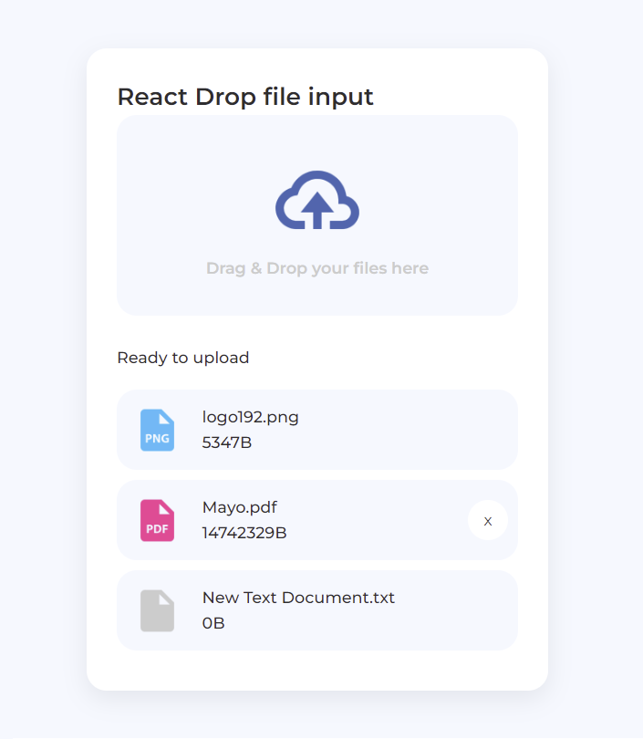

# Drop File Input

Aplicación realizada con React, Javascript, Hooks y CSS

  

##

## Pasos para instalar este proyecto
1. Clona el repositorio
$ git clone https://github.com/LulaZeta/drop-file-input_react.git

2. Instalación
$ npm install

3. Ejecutar el servidor de desarrollo.
$ npm start