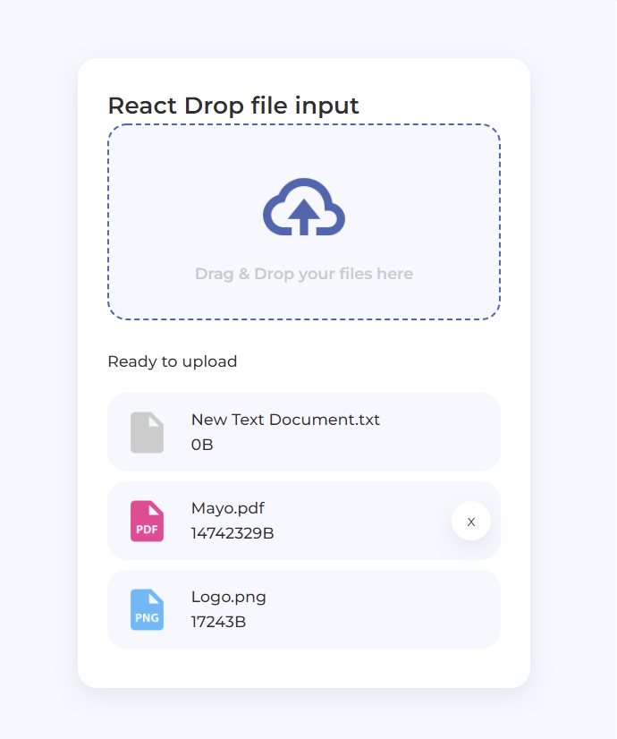

# Drop File Input

Aplicación hecha con Create React App.

  

## Realizado con:
- React
- CSS 
- JavaScript
- Hooks
- verificación de tipos PropTypes

PropTypes exporta un rango de validadores que pueden ser usados para estar seguros que la información recibida sea válida (PropTypes solo se verifica en modo desarrollo). 

## Pasos para instalar este proyecto
1. Clona el repositorio
$ git clone https://github.com/LulaZeta/drop-file-input_react.git

2. Instalación
$ npm install

3. Ejecutar el servidor de desarrollo.
$ npm start